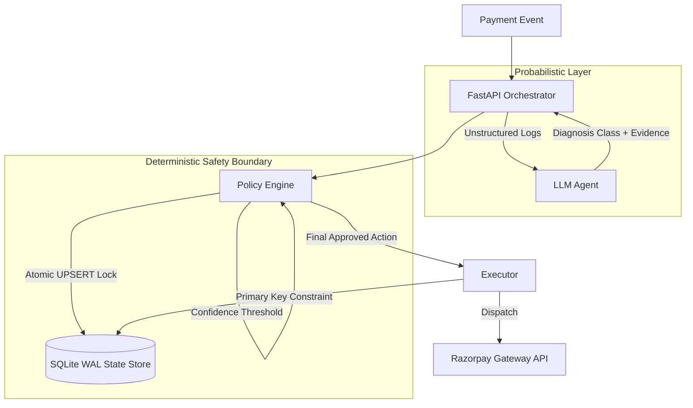

# RevGuard AI
### Autonomous Revenue Recovery Engine & Deterministic Policy Gate
*Razorpay Buildathon 2026 — Track 03: AI Revenue Recovery*

---

## Executive Summary
Most AI agent architectures operate as open-ended loops: the model receives broad tool access, formulates an intent, and mutates state directly. In financial transaction processing, direct autonomous model execution introduces unacceptable double-charge and regulatory risks.

RevGuard AI separates probabilistic reasoning from deterministic execution:
1. **Probabilistic Layer (LLM Diagnosis):** Evaluates messy bank gateway error strings and emits a typed diagnostic proposal.
2. **Deterministic Layer (Policy Engine Gate):** Validates business constraints (economic floor, retry limits, confidence threshold) and computes the exact recovery action.
3. **Execution Layer (Idempotency Store):** Enforces SQLite Write-Ahead-Logging (WAL) locks to guarantee at-most-once gateway execution.

---

## The Business Problem
Payment gateways lose significant Transaction Processing Volume (TPV) due to transient network timeouts, issuer bank degradations, and false fraud triggers.
* **Blind Retries:** Naive retry mechanisms trigger issuer penalties and merchant flags.
* **Manual Review:** Human investigation is infeasible at high transaction volumes.
* **Solution:** An intelligent, deterministic recovery system that maximizes net economic contribution while enforcing mathematical idempotency.

---

## Architecture and Trust Boundaries



### Trust Boundary Matrix
| Component | Function | Execution Authority |
| :--- | :--- | :--- |
| **LLM Agent** | Diagnoses root cause from unstructured logs | None. Emits typed schema only. |
| **Policy Engine** | Evaluates invariants and determines action | Absolute. Overrides or halts unsafe proposals. |
| **State Store** | Idempotency and audit persistence | Absolute. Enforces WAL single-writer isolation. |
| **Executor** | Dispatches approved actions | Execution. Adheres strictly to policy gate outputs. |
| **Operator Console** | Real-time monitoring and verification | Read-only / Trigger interface. |

---

## Safety Invariants
1. **At-Most-Once Execution:** Every payment recovery attempt is tracked via an atomic reservation lock before diagnosis begins.
2. **Economic Floor:** Interventions are halted if the expected transaction amount falls below the operational cost threshold (`amount > 100 INR`).
3. **Bounded Retries:** Transactions are limited to a maximum of 1-2 attempts before permanent escalation.
4. **Primary Key Idempotency:** The execution ledger enforces a primary key constraint on `(event_id, attempt_number)` at the database level.

---

## Adversarial Verification Scenarios
The test suite includes dedicated failure injection scenarios:
* **Concurrent Webhooks (`/api/failure/concurrent-webhooks`):** Simulates concurrent delivery of identical webhook events. Verifies single-winner election via atomic SQLite UPSERT.
* **Stale Reservation (`/api/failure/stale-reservation`):** Simulates an ungraceful crash during diagnosis, confirming safe recovery and escalation.
* **Duplicate Executor (`/api/failure/duplicate-executor`):** Verifies that duplicate dispatch calls are blocked by database primary key constraints before reaching the gateway.

---

## Tech Stack
* **Backend:** Python 3.10+, FastAPI, Pydantic, SQLite (WAL mode enabled)
* **Frontend:** React 18, Vite, Tailwind CSS, Framer Motion, Three.js
* **Testing:** Pytest, coverage suite

---

## Local Setup

### 1. Backend Service
```bash
python3 -m venv venv
source venv/bin/activate
pip install -r requirements.txt

# Run test suite
pytest -q

# Start API server
uvicorn server:app --reload --port 8000
```

### 2. Frontend Console
```bash
cd frontend
npm install
npm run dev
```

Access the operator console at `http://localhost:5173`.
