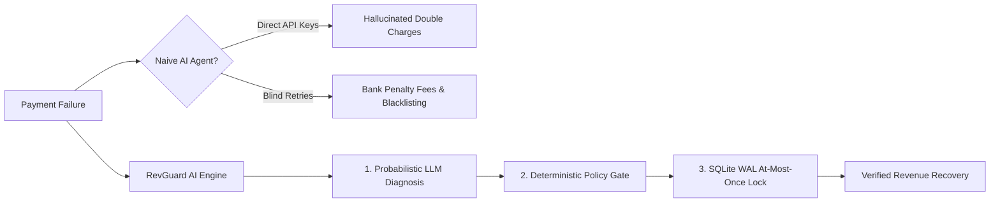
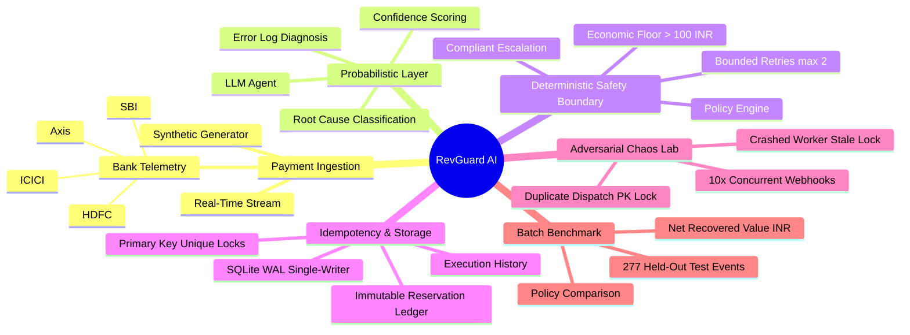
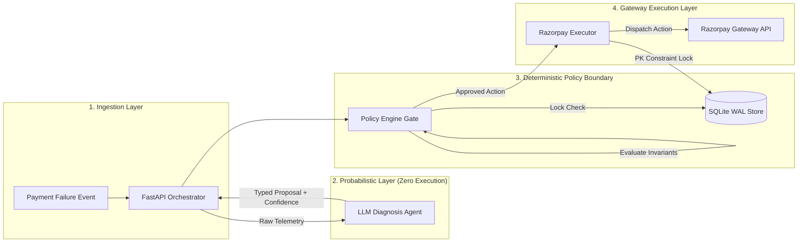
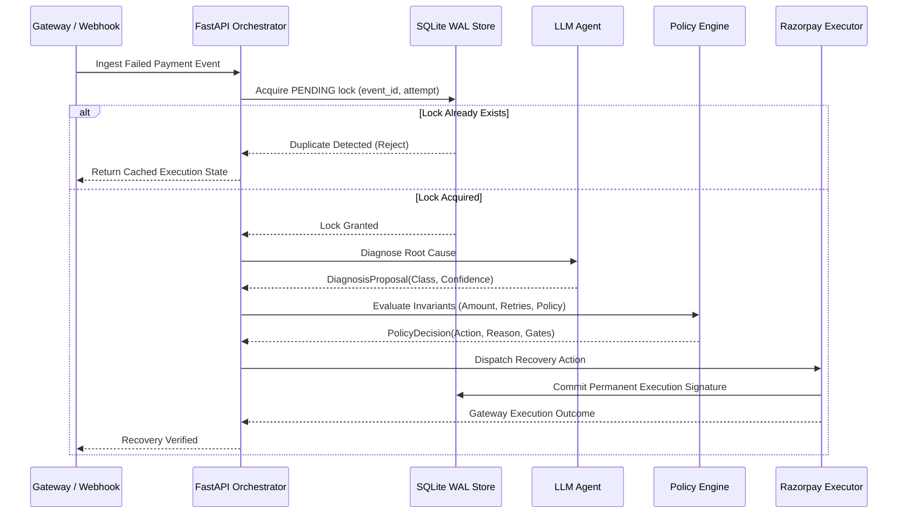
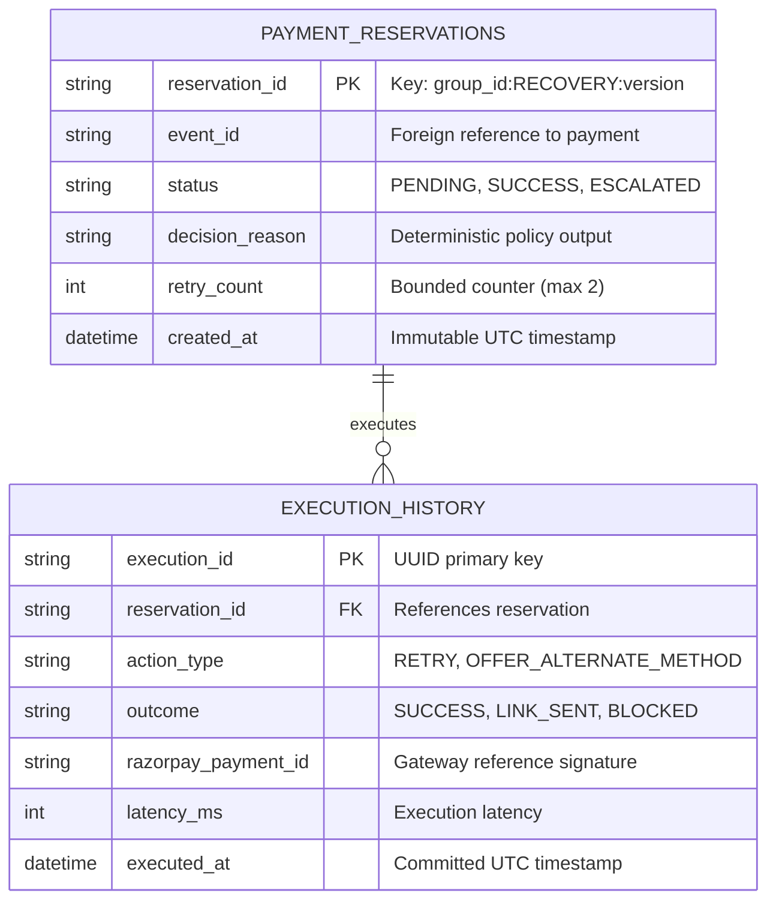

<div align="center">

# RevGuard.ai

### Autonomous AI Revenue Recovery Engine & Deterministic Policy Gate
*Built for the **Razorpay Buildathon 2026** · **Track 03: AI Revenue Recovery***

<br />


<br />

<a href="https://razorpay-build-a-thon-2026-rev-guar.vercel.app/"></a>
<a href="https://revguard-backend.onrender.com/docs"></a>
<a href="https://github.com/Avinraj01/Razorpay-Build_A_Thon-2026---RavGuard.ai"></a>

<br /><br />


<br /><br />

**RevGuard.ai** reverses the fragile AI agent paradigm in fintech: a probabilistic **LLM Diagnosis** proposes root causes from messy bank errors, while an absolute **Deterministic Policy Gate** enforces financial invariants (economic floors, retry limits, at-most-once delivery) backed by durable **SQLite Write-Ahead-Log (WAL)** single-writer locks.

</div>

---

# 📑 Razorpay Buildathon 2026 · Track 03 Challenge

<div align="center">

### 🏆 Official Problem Statement: AI Revenue Recovery
**"Find revenue that’s slipping away and win it back."**

<br />

<a href="https://razorpay.com/buildathon/">
  
</a>

<br /><br />

**[🌐 Open Official Razorpay Buildathon Website](https://razorpay.com/buildathon/)** &nbsp;&nbsp;·&nbsp;&nbsp; **[🚀 Launch Live RevGuard.ai Operator Console](https://razorpay-build-a-thon-2026-rev-guar.vercel.app/)**

</div>

---

# What Problem Does RevGuard AI Solve?

Every day, payment gateways lose billions in processed volume globally to transient network drops, issuer bank degradations, and false fraud holds.



### Challenge vs. Solution Matrix

| Challenge in AI Payments | Industry Failure Mode | RevGuard AI Solution |
|:---|:---|:---|
| **Autonomous Hallucinations** | Agent issues unauthorized refunds/retries | **Sandboxed Diagnosis:** LLM emits typed strings only, zero direct execution authority. |
| **Double-Charge Hazards** | Duplicate webhooks charge customers twice | **Atomic SQLite WAL:** Primary key locks on `(event_id, attempt_number)` reject race conditions. |
| **Spamming Issuer Banks** | Blind retries incur penalties | **Smart Alternate Rails:** Routes degraded bank traffic (e.g. SBI/HDFC down) to fallback UPI/3DS. |
| **Negative ROI Actions** | Spending ₹15 to recover a ₹10 cart | **Strict Economic Floor:** Halts recovery if transaction value is `< ₹100 INR`. |
| **Infinite Retries** | Customer gets trapped in loop | **Bounded Stopping Rules:** Hard limit of max 1-2 attempts before graceful human escalation. |
| **Unverified AI Claims** | Vague success claims without data | **277 Held-Out Batch Benchmark:** Net Contribution calculation accounting for friction & API costs. |

---

# Core Features & Innovations

- **Sandboxed LLM Diagnosis:** Fast LLM reasoning classifies messy timeout logs, issuer downtime, and checkout regressions into typed proposals.
- **Deterministic Policy Gate:** Hardcoded Python rule engine with invariant guards (`Rule 0` to `Rule 5`).
- **Durable SQLite WAL State Store:** Write-Ahead-Log single-writer isolation guaranteeing at-most-once execution.
- **3D Three.js Quantum Visualizer:** 60 FPS WebGL wave mesh and constellation nodes for real-time telemetry.
- **Photorealistic 3D Titanium Card Intro:** Interactive mouse parallax tilt, gold EMV chip, and holographic laser scan.
- **Webflow The-Eternals 3D Dual Marquee:** Continuous dual-perspective ribbon streaming financial invariants.
- **Adversarial Chaos Lab:** Live triggerable simulation testing 10x concurrent webhook races, worker crashes, and duplicate execution interception.
- **277 Held-Out Batch Benchmark:** Proves net positive economic value against 3 baseline policies.
- **Cryptographic WAL Ledgers:** Real-time query interface for `payment_reservations` and `execution_history`.

---

# Live Operator Console

### Production Web Application
<div align="center">

<a href="https://razorpay-build-a-thon-2026-rev-guar.vercel.app/">
  
</a>

<br />

**[Open RevGuard AI Live Operator Console](https://razorpay-build-a-thon-2026-rev-guar.vercel.app/)**

<sub>Click above to launch the 3D Operator Console on Vercel.</sub>

</div>

---

# High-Level Mind Map



---

# System Architecture & Trust Boundaries



### Trust Boundary Matrix

| Component | Responsibility | Execution Authority | Security Guarantee |
|:---|:---|:---|:---|
| **LLM Agent** | Classifies root-cause from error strings | **None.** Output is strictly typed schema. | Cannot execute fund movements or trigger APIs. |
| **Policy Engine** | Evaluates invariants and business rules | **Absolute.** Can override, reject, or escalate. | Deterministic, test-covered, replayable logic. |
| **State Store** | Idempotency & audit persistence | **Absolute.** Atomic SQLite single-writer lock. | Mathematical zero double-charge guarantee. |
| **Executor** | Dispatches recovery action to gateway | **Bounded.** Executes only Policy Gate orders. | Primary key constraint halts duplicate dispatch. |
| **React Console** | Visualizes live state & batch economics | **Read-Only / Trigger.** | Cannot alter invariants or bypass policy checks. |

---

# End-to-End Recovery Flow



---

# Economic Model & Benchmark Formula

RevGuard AI evaluates policies based on **Net Economic Contribution Value**, not misleading gross retry counts:

$$\text{Net Value} = \text{Gross Recovered INR} - (\text{Action Cost} + \text{Friction Cost} + \text{Escalation Cost})$$

### 277 Held-Out Batch Benchmark Results (70/30 Chronological Split)

| Policy Name | Evaluated Events | Recoveries Won | False Actions | Gross Value (INR) | Operational Costs (INR) | Net Recovered ROI (INR) | Rank |
|:---|:---:|:---:|:---:|:---:|:---:|:---:|:---:|
| **No Action** | 277 | 0 | 0 | ₹0.00 | ₹0.00 | **₹0.00** | 4th |
| **Blind Retry** | 277 | 84 | 193 | ₹4,545.97 | ₹1,519.00 | **₹3,026.97** | 3rd |
| **Rule Baseline** | 277 | 59 | 19 | ₹3,212.74 | ₹185.00 | **₹3,027.74** | 2nd |
| **RevGuard AI Agent** | **277** | **69** | **41** | **₹3,763.22** | **₹310.00** | **₹3,453.22** | **1st (Winner)** |

---

# Adversarial Chaos & Invariant Verification Lab

| Scenario ID | Test Name | Simulated Adversity | Verified Invariant Proof |
|:---|:---|:---|:---|
| **CHAOS-01** | `concurrent-webhooks` | 10 concurrent requests arrive at the exact same millisecond | Atomic SQLite UPSERT elects exactly 1 worker. 9 others read cached state. |
| **CHAOS-02** | `stale-reservation` | Worker crashes mid-diagnosis leaving an orphaned `PENDING` lock | Policy engine sweeps stale lock and safely degrades to `STOP_AND_ESCALATE`. |
| **CHAOS-03** | `duplicate-executor` | Network timeout right before physical dispatch triggers replay | Database primary key constraint blocks 2nd physical write before API call. |

---

# Technology Stack

| Layer | Technology | Version | Purpose |
|:---|:---|:---|:---|
| **Frontend Framework** | React | 18.2 | Component architecture and state hydration |
| **Build Tool** | Vite | 5.2 | Ultra-fast HMR and optimized production bundling |
| **3D Engine** | Three.js / WebGL | 0.164 | 60 FPS Quantum Wave Mesh & constellation nodes |
| **Animation** | Framer Motion | 13.1 | Smooth micro-interactions, layout transitions, marquees |
| **Styling** | Tailwind CSS | 3.4 | Finera glassmorphism tokens and dark theme styling |
| **Backend Framework** | FastAPI | 0.128 | High-throughput asynchronous REST API |
| **Schema Validation** | Pydantic | 2.13 | Strict runtime type checking and enum boundary guards |
| **Database** | SQLite (WAL Mode) | 3.x | Single-writer Write-Ahead-Log atomic transaction store |
| **Testing** | Pytest | 8.4 | Unit, security, and invariant test suite |
| **Frontend Hosting** | Vercel | Global CDN | Production frontend deployment |
| **Backend Hosting** | Render | Cloud Web Service | Python FastAPI server deployment |

---

# REST API Surface

| Method | Endpoint | Description | Request / Response Schema |
|:---|:---|:---|:---|
| `GET` | `/api/events` | Ingest recent failed payment events | `limit: int` $\rightarrow$ `List[PaymentEvent]` |
| `POST` | `/api/events/new` | Ingest next real-time anomaly event | `None` $\rightarrow$ `PaymentEvent` |
| `POST` | `/api/pipeline/run` | Execute 3-stage deterministic recovery | `{ event: PaymentEvent }` $\rightarrow$ `PipelineResult` |
| `GET` | `/api/metrics` | Fetch aggregated TPV & throughput telemetry | `None` $\rightarrow$ `TelemetryMetrics` |
| `GET` | `/api/evaluation/benchmark` | Run 277 held-out batch evaluation | `None` $\rightarrow$ `BenchmarkComparison` |
| `POST` | `/api/failure/concurrent-webhooks` | Inject 10x concurrent race scenario | `None` $\rightarrow$ `ChaosVerificationResult` |
| `POST` | `/api/failure/stale-reservation` | Inject worker crash & sweep scenario | `None` $\rightarrow$ `ChaosVerificationResult` |
| `POST` | `/api/failure/duplicate-executor` | Inject duplicate dispatch scenario | `None` $\rightarrow$ `ChaosVerificationResult` |
| `GET` | `/api/state/reservations` | Direct query on `payment_reservations` WAL table | `None` $\rightarrow$ `List[ReservationRow]` |
| `GET` | `/api/state/executors` | Direct query on `execution_history` audit table | `None` $\rightarrow$ `List[ExecutionRow]` |
| `POST` | `/api/state/reset` | Reset WAL tables to pristine initial state | `None` $\rightarrow$ `StatusResponse` |

---

# Relational Data Model (SQLite WAL)



---

# Test Suite & Verification Matrix

All 17 automated tests pass in `< 1.0s`:

| Test ID | Module | Invariant Tested | Expected Result |
|:---|:---|:---|:---|
| `TC-01` | `test_policy_engine` | Duplicate idempotency call on same group | Intercepted via cache, retry count not incremented |
| `TC-02` | `test_policy_engine` | Transaction amount < ₹100 INR | Gated to `NO_ACTION` (economic floor abort) |
| `TC-03` | `test_policy_engine` | Retry count >= 1 | Gated to `STOP_AND_ESCALATE` (bounded rule) |
| `TC-04` | `test_policy_engine` | LLM diagnosis confidence < 0.80 | Gated to `NO_ACTION` (abstain on low confidence) |
| `TC-05` | `test_policy_engine` | Payment already `SUCCESS` | Gated to `NO_ACTION` (prevent over-recovery) |
| `TC-06` | `test_policy_engine` | `BANK_DEGRADATION` diagnosis | Maps deterministically to `OFFER_ALTERNATE_METHOD` |
| `TC-07` | `test_policy_engine` | `MERCHANT_CHECKOUT_REGRESSION` | Maps deterministically to `STOP_AND_ESCALATE` |
| `TC-08` | `test_policy_engine` | `TRANSIENT_TIMEOUT` diagnosis | Maps deterministically to `RETRY` (1 bounded attempt) |
| `TC-09` | `test_policy_engine` | Proposal confidence > 1.0 or < 0.0 | Pydantic validation error raised |
| `TC-10` | `test_policy_engine` | NaN / Infinity in confidence float | Pydantic validation error raised |
| `TC-11` | `test_policy_engine` | Concurrency thread contention | Exactly 1 lock claimed, 0 corrupted states |
| `TC-12` | `test_policy_engine` | Executor timeout recovery replay | Intercepted via state cache |
| `TC-13` | `test_server` | Ingest events endpoint (`/api/events`) | 200 OK with mapped event list |
| `TC-14` | `test_server` | Generate new event (`/api/events/new`) | 200 OK with typed event payload |
| `TC-15` | `test_server` | Pipeline execution lifecycle (`/api/pipeline/run`) | 200 OK with 3-stage trace |
| `TC-16` | `test_server` | Duplicate pipeline invocation | Returns `duplicate_blocked: true` |
| `TC-17` | `test_server` | SQLite state query endpoints | Returns WAL table rows |

---

# Repository Layout

```text
Razorpay-Build_A_Thon-2026-RevGuard.ai/
│
├── schema.py                   # Pydantic models for payment events & enum invariants
├── proposals.py                # Typed LLM diagnostic proposals & confidence schema
├── state_store.py              # SQLite WAL thread-safe idempotency repository
├── policy_engine.py            # Deterministic Policy Gate (Rules 0–5 bounded logic)
├── llm_agent.py                # Probabilistic LLM failure classifier
├── executor.py                 # Idempotent Razorpay gateway execution adapter
├── audit_log.py                # Thread-safe JSONL append-only audit logger
├── server.py                   # Typed FastAPI REST routes & CORS boundary
├── evaluation_harness.py       # 277 held-out chronological batch evaluation engine
├── milestone7_failure_injection.py # Chaos Lab: concurrency, crashes, & duplicates
├── milestone8_demo.py          # End-to-end CLI demonstration runner
├── generate_data.py            # Reproducible synthetic dataset generator
├── test_policy_engine.py       # Pytest suite for deterministic invariants
├── test_server.py              # Pytest suite for FastAPI REST endpoints
├── requirements.txt            # Python pinned dependencies
├── DECISIONS.md                # Formal Architecture Decision Records (ADR-001..003)
│
├── frontend/
│   ├── src/
│   │   ├── components/
│   │   │   ├── PreloaderIntro.jsx       # 3D titanium metal card & binary matrix stream
│   │   │   ├── InteractiveSky.jsx       # 60 FPS Three.js WebGL quantum wave mesh
│   │   │   ├── HeroPhoneVisual.jsx      # 3D smartphone mockup with floating crystal badges
│   │   │   ├── ParadigmRibbonStripe.jsx # Webflow The-Eternals 3D dual perspective marquee
│   │   │   ├── KpiBar.jsx               # Telemetry impact & throughput stat cards
│   │   │   ├── EventStream.jsx          # Live payment ingestion feed with bank badges
│   │   │   ├── PipelineViz.jsx          # 3-stage deterministic policy visualizer
│   │   │   ├── BatchBenchmarkSection.jsx# 4-policy held-out benchmark with net ROI calculation
│   │   │   ├── FailurePanel.jsx         # Adversarial Invariant Verification Lab
│   │   │   └── AuditTables.jsx          # SQLite WAL ledger query tables
│   │   ├── lib/
│   │   │   └── api.jsx                  # Typed Axios client & INR currency formatters
│   │   ├── App.jsx                      # Symmetrical page layout & capsule navigation
│   │   ├── index.css                    # Design tokens & glassmorphism utilities
│   │   └── main.jsx                     # Application root mount
│   ├── index.html                       # Semantic HTML5 head & typography preconnects
│   ├── vite.config.js                   # Vite bundler configuration
│   └── package.json                     # Frontend manifest & scripts
│
├── .gitignore
└── README.md
```

---

# Local Development Guide

### 1. Backend Setup (FastAPI + SQLite WAL)
```bash
# Clone the repository
git clone https://github.com/Avinraj01/Razorpay-Build_A_Thon-2026---RavGuard.ai.git
cd Razorpay-Build_A_Thon-2026---RavGuard.ai

# Create and activate virtual environment
python3 -m venv venv
source venv/bin/activate       # Windows: venv\Scripts\activate

# Install dependencies
pip install -r requirements.txt

# Run the 17-point invariant test suite
pytest -q

# Start the REST API server
uvicorn server:app --reload --port 8000
```
* Backend API: `http://localhost:8000`
* Swagger Docs: `http://localhost:8000/docs`

### 2. Frontend Setup (React 18 + Three.js + Vite)
```bash
cd frontend

# Install dependencies
npm install

# Start development server
npm run dev
```
* Operator Console: `http://localhost:5173`

---

# Author & Credits

<div align="center">

**Avin Raj**  
*Computer Science & Engineering*

Built for **Razorpay Buildathon 2026** · **Track 03: AI Revenue Recovery**

<br />

<a href="https://razorpay-build-a-thon-2026-rev-guar.vercel.app/"></a>

</div>
